# Data Mining on TikTok Video and User Engagement

*In a digital era where video content dominates, this report investigates methods to verify TikTok video content and enhance user engagement. By analyzing over 19,000 videos, we have identified methods to detect potentially misleading content and understand what drives user interaction. Our work is pivotal for digital advertising, platform governance, and the creation of a trustworthy social media environment.*

## Table of Contents
- [Introduction](#introduction)
- [Data Sources](#data-sources)
- [Proposed Methodology](#proposed-methodology)
- [Analysis and Results](#analysis-and-results)
- [Conclusions](#conclusions)

## Introduction

This report explores TikTok's content authenticity and user interaction patterns using data-driven techniques, highlighting its impact on digital communication and advertising.

### Motivation

The motivations driving this research are manifold, focusing on enhancing user experience and trust within TikTok's platform:
- Ensuring **content integrity** to establish TikTok as a source of reliable information.
- Improving **advertising effectiveness** through detailed analysis of user engagement metrics.
- Advancing **content recommendation algorithms** for personalized user experiences.

### Problem Statement and Solving Strategies

We address the following key questions to navigate the challenges of data mining in the context of TikTok:
- **Classification of Content:** Development and implementation of algorithms to discern and categorize video content based on authenticity.
- **Engagement Analysis:** Utilization of clustering techniques to segment videos by user interaction levels, revealing patterns that drive engagement.
- **Share-ability Assessment:** Application of NLP to determine the share-ability of content, identifying what makes certain videos more viral than others.

### Data Mining Challenges

In exploring TikTok's user engagement and content reliability, we faced multiple challenges:
- **Data Complexity:** Managing the volume, diversity, and quality of data.
- **Model Precision and Bias:** Developing accurate models while avoiding bias and over-fitting.
- **Broad Applicability:** Ensuring findings and methodologies are adaptable across various social media platforms.

## Data Sources

### Overview of the Data Set

The dataset, sourced from Kaggle, includes 19,382 TikTok videos, categorized as 'claim' or 'opinion', with a range of engagement metrics. Details: [Kaggle Dataset](https://www.kaggle.com/datasets/yakhyojon/tiktok/data).

### Composition of the Dataset

Our analysis begins with an expansive dataset comprising 19,382 TikTok videos, each encapsulating various facets of user engagement. Each video in the dataset is described by 12 distinct attributes, which include both quantitative engagement metrics and categorical descriptors for content type.

### Attributes of Interest

#### Table: Introduction of the Data Columns

Column Name | Type | Description
------------|------|------------
\# | int | TikTok assigned number for video with claim/opinion.
claim_status | obj | Whether the published video has been identified as an “opinion” or a “claim.”
video_id | int | Random identifying number assigned to video.
video_duration_sec | int | Video duration in seconds.
video_transcription_text | obj | Transcribed text of the words spoken in the published video.
verified_status | obj | The status of the user who published the video in terms of their verification.
author_ban_status | obj | The status of the user who published the video in terms of their permissions.
video_view_count | float | Total number of times the published video has been viewed.
video_like_count | float | Total number of times the published video has been liked by other users.
video_share_count | float | Total number of times the published video has been shared by other users.
video_download_count | float | Total number of times the published video has been downloaded by other users.
video_comment_count | float | Total number of comments on the published video.

Note: regarding claim status, an “opinion” refers to an individual’s or group’s personal belief or thought.
A “claim” refers to information that is either unsourced or from an unverified source.

### Initial Data Exploration

An initial glimpse into the dataset showcases the diversity of content and engagement.

#### Table: Summary of Video Data

\# | claim_status | video_id | video_duration_sec | video_transcription | verified_status | author_ban_status | video_view_count | video_like_count | video_share_count | video_download_count | video_comment_count
---|--------------|----------|--------------------|---------------------|-----------------|-------------------|------------------|------------------|------------------|---------------------|--------------------
0 | claim | 7017666017 | 59 | ... | not verified | under review | 343296.0 | 19425.0 | 241.0 | 1.0 | 0.0
1 | claim | 4014381136 | 32 | ... | not verified | active | 140877.0 | 77355.0 | 19034.0 | 1161.0 | 684.0
2 | claim | 9859838091 | 31 | ... | not verified | active | 902185.0 | 97690.0 | 2858.0 | 833.0 | 329.0
3 | claim | 1866847991 | 25 | ... | not verified | active | 437506.0 | 239954.0 | 34812.0 | 1234.0 | 584.0
4 | claim | 7105231098 | 19 | ... | not verified | active | 56167.0 | 34987.0 | 4110.0 | 547.0 | 152.0

Note: Regarding video transcription text, as this assignment does not incorporate text analysis, the
value presented in the preceding table has been streamlined.

### Missing Values and Duplicates

To ensure the reliability of our findings, we meticulously addressed issues of missing information and redundancy:
- **Handling Missing Values:** Identified and removed missing values from the dataset.
- **Addressing Duplicate Records:** Confirmed no duplicate values, indicating a unique dataset.

After removing 298 entries with missing data and confirming no duplicates, the dataset comprises
19,084 unique videos for analysis.

### General Exploratory Data Analysis (EDA)

#### Categorical Data

Categorical data variables play a crucial role in understanding the characteristics of the TikTok data set. Our exploratory data analysis revealed the following distributions. (You might consider summarizing the key findings or including images of the charts.)

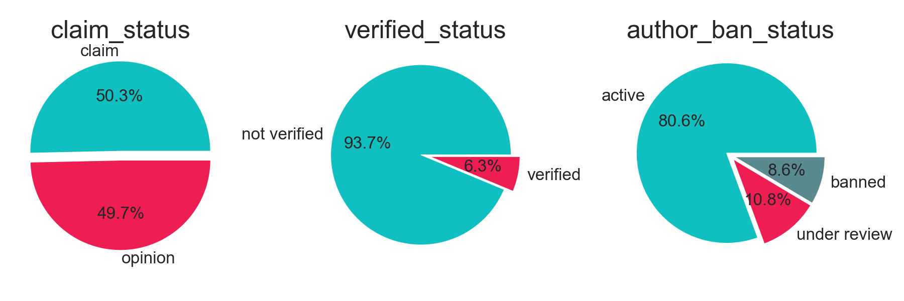

- **Claim Status:** The data set is almost evenly split between videos labeled as 'opinion' and 'claim', with 49.65% and 50.35% respectively, signifying a balanced representation of content types.
- **Verified Status:** A large majority of video authors, 93.71%, are not verified, while only a small fraction, 6.29%, have verified status. This suggests that the platform is predominantly used by non-verified users.
- **Author Ban Status:** Most authors are active, constituting 80.61% of the data set. A smaller percentage of authors are 'banned' (8.57%) or 'under review' (10.83%), indicating moderate levels of content moderation.

#### Numerical Data

The numerical data in our dataset primarily comprises video duration and various engagement metrics.

Histograms were generated for each attribute in the data set to observe their distributions:

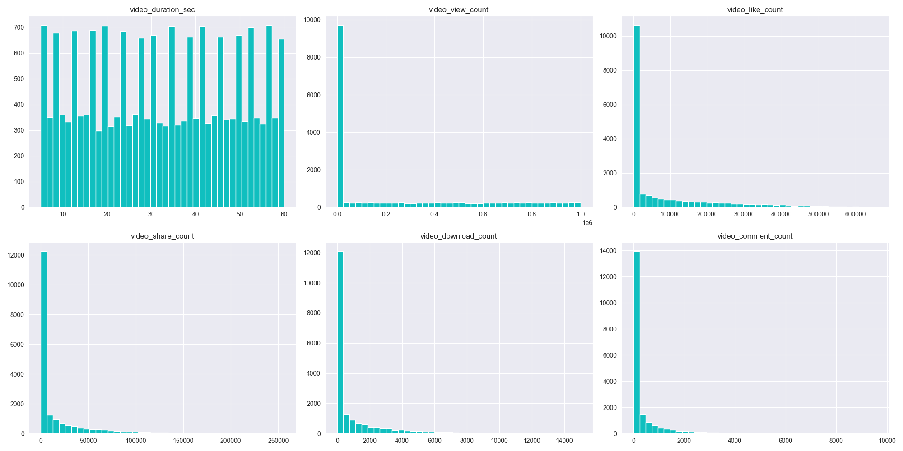

Box plots were generated for each attribute in the data set:

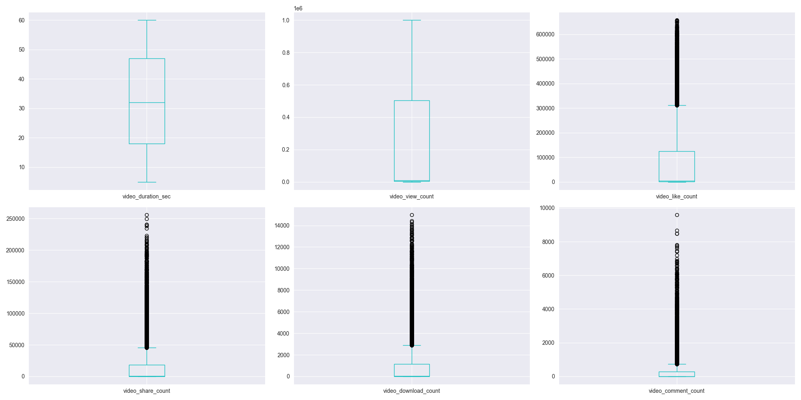

Our exploratory data analysis (EDA) of these quantities has yielded key insights:

- **Video Duration:** The duration of the videos shows a uniform distribution, indicating a wide variety of content lengths with no apparent extremes or biases towards shorter or longer videos.
- **Engagement Metrics:** Metrics such as views, likes, shares, downloads, and comments are heavily right-skewed. This suggests that while most videos receive a low level of engagement, there are a few videos that achieve exceptionally high engagement, standing out as outliers.

These findings are crucial as they suggest that most content struggles to achieve virality, with only a few videos breaking through to significant popularity. 

## Proposed Methodology

Our methodology includes data collection and cleaning, exploratory data analysis, data processing, standardization, and applications of classification, clustering, and topic modeling techniques to derive insights.

### Data Mining Process

The data analysis for this study is partitioned into several sequential stages, each building on the findings of the previous one. (Elaborate on the stages or use a diagram to illustrate.)
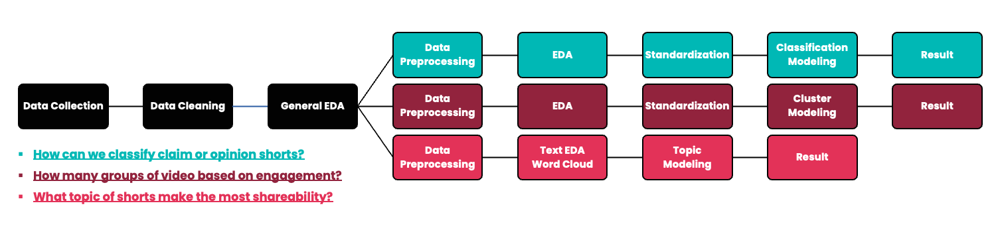

Note:  The top flow relates to classifying claim or opinion shorts, the middle flow relates to grouping videos by user engagement, and the bottom flow focuses on identifying topics that enhance share-ability.

The detail explanation of each stage is as follows:

- **Data Collection:** Sourced over 19,000 TikTok video records from Kaggle.
- **Data Cleaning:** Removed missing values and duplicates for a clean dataset.
- **General EDA:** Broad analysis of categorical and numerical variables.
- **Data Pre-processing:** Prepared data for analysis with normalization and transformation.
- **EDA:** In-depth analysis using visualizations to identify patterns.
- **Standardization:** Normalized data to a common scale for machine learning.
- **Classification Modeling:** Created models to classify video content authenticity.
- **Cluster Modeling:** Used clustering to segment videos by user interactions.
- **Topic Modeling:** Employed NLP to uncover themes in video transcriptions.

These stages are designed to incrementally advance our understanding, culminating in actionable insights into the drivers of user engagement on TikTok.

### Research Question 1: Classifying Claims and Opinions

Our method for classifying TikTok videos into claims or opinions includes:

- **Feature Selection:** Focusing on claim status, video duration, user verification, author status, and engagement metrics.
- **Visualization Techniques:** Using pie charts, pair plots, KDE plots, heat maps, and histograms.
- **Models for Classification:** Implementing Random Forest, Gradient Boosting, KNN, LDA, Logistic Regression, and Decision Tree.
- **Challenges:** Addressing multicollinearity, hyper-parameter tuning, and over-fitting.
- **Process Stages:** Covering data pre-processing, EDA, standardization, classification modeling, and result interpretation.

This streamlined process aims to accurately categorize video content on TikTok.

### Research Question 2: Clustering User Engagement Metrics

Our approach to understanding user engagement patterns on TikTok involves:

- **Feature Selection:** Analyzing metrics like video views, likes, shares, downloads, and comments.
- **Visualization Techniques:** Utilizing the Elbow diagram for optimal cluster identification in K-means.
- **Models for Clustering:** Applying K-means for unsupervised clustering.
- **Challenges:** Determining the right number of clusters and ensuring adequate iteration for optimal clustering.
- **Process Stages:** Involving data preprocessing, EDA, standardization, cluster modeling, and result interpretation.

This method aims to segment TikTok videos into distinct engagement groups for deeper insights.

### Research Question 3: Topic Clustering and Share-ability

Our approach for analyzing the share-ability of TikTok videos involved:

- **Feature Selection and Preprocessing:** Focusing on video transcriptions and related metrics.
- **Visualization and Modeling:** Employing word clouds, sentiment analysis, and Latent Dirichlet Allocation (LDA) for topic modeling.
- **Challenges and Goals:** Addressing text analysis complexity and identifying key topics driving share-ability.

This approach is designed to identify the thematic elements that contribute to the viral nature of TikTok videos, contributing to a deeper understanding of content share-ability on the platform.

### Conclusion of Methodology

Our methodical approach ensures a systematic exploration of the TikTok data set, with the ultimate goal of unveiling the intricacies of content engagement. By the end of this process, we aim to offer a clear narrative of what drives user interactions and share-ability on TikTok, providing valuable insights for content creators and platform moderators alike.

## Analysis and Results

### Research Question 1: Classifying Claims and Opinions

#### Data Pre-processing

We streamlined our data set by selecting key attributes indicative of content type (video characteristics and user interaction metrics) and encoded categorical data for algorithmic interpretation. Binary and tripartite categories were processed using appropriate encoding schemes to facilitate subsequent analyses.

**Feature Selection**

We began by selecting attributes from our dataset that are most relevant to determining whether a video content is a claim or an opinion. These attributes included:

- *Video Characteristics:* Duration and claim status.
- *User Interaction Metrics:* Number of views, likes, shares, downloads, and comments.
- *User Statuses:* Whether the user is verified and the current ban status of the author.

**Categorical Data Encoding**

Our dataset contained categorical data, which are variables that represent types of data which may be divided into groups. To make this data comprehensible to our algorithms, we encoded it:

- Binary categories, such as verified status (verified or not), were converted to 0s and 1s.
- Tripartite categories, such as author ban status (active, banned, under review), were transformed using one-hot encoding—a technique that creates new columns indicating the presence of each possible value.

#### Exploratory Data Analysis - Categorical Data

The exploratory analysis of categorical data offers insights into the authenticity and user-related statuses of TikTok video content. We summarize our findings as follows:

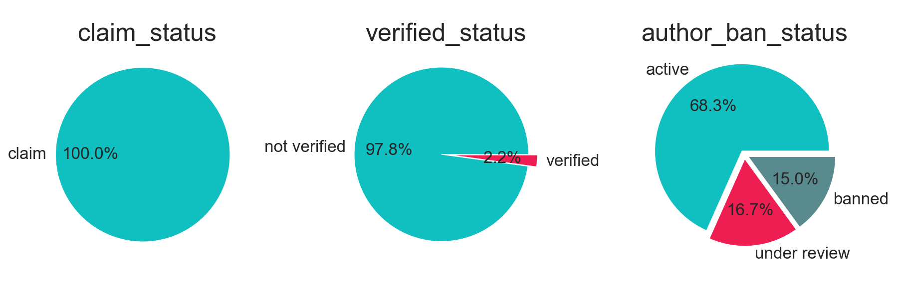

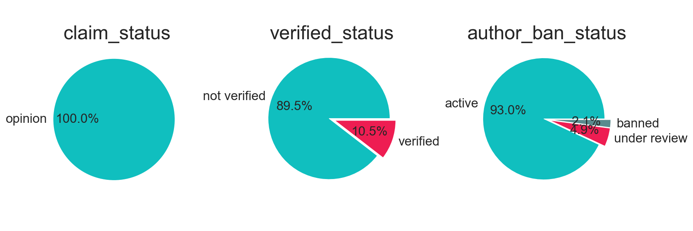

**Verification Status**

Our analysis shows a majority of videos, both claims and opinions, are from unverified sources. However, opinions are slightly more likely to be verified compared to claims, suggesting a potential difference in source credibility or content nature.

**Author Ban Status**

The data reveals a varied ban status among authors. Active users predominate, especially in the opinion category, indicating a possibly less controversial nature or differing standards in the moderation process.

The following tables encapsulate the categorical distribution within our dataset:

*Distribution of Verification Status by Claim Type*

| Claim Status | Not Verified | Verified |
|--------------|--------------|----------|
| Opinion      | 8485         | 991      |
| Claim        | 9399         | 209      |

*Author Ban Status by Claim Type*

| Claim Status | Active | Banned | Under Review |
|--------------|--------|--------|--------------|
| Opinion      | 8817   | 196    | 463          |
| Claim        | 6566   | 1439   | 1603         |

The prevalence of non-verified content suggests that TikTok's platform is widely used by regular users rather than officially verified entities. The author ban status distribution indicates a healthier discourse in opinions, with fewer authors facing bans or being under review compared to claim videos. 

#### Exploratory Data Analysis - Numerical Data

Through the lens of exploratory data analysis, we have observed the behavior of numerical metrics associated with TikTok videos and their engagement levels. 

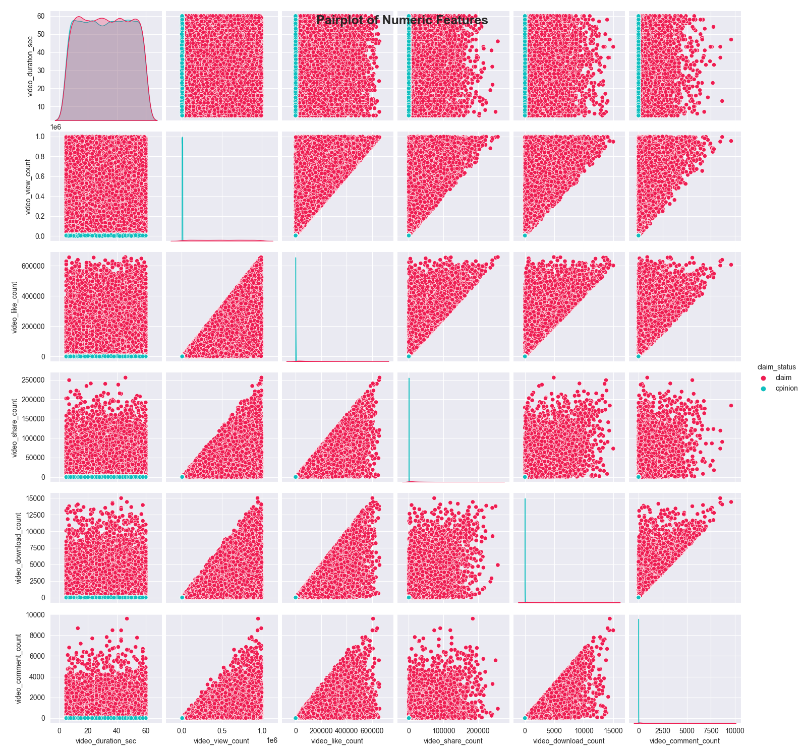

**Video Duration and Engagement Metrics**

The analysis indicates that the length of a video does not necessarily influence whether it is categorized as a claim or an opinion. Moreover, a consistent observation is that 'claims' tend to engage users more than 'opinions', as evidenced by higher variability and occasional peaks in engagement measures.

**Correlation Insights**

A deeper look into the relationships between various metrics such as views, likes, shares, and comments revealed positive correlations. This means that typically, videos that are viewed more frequently also tend to be liked and shared more, a pattern that is intuitive in the realm of social media.

**Kernel Density Estimation**

From the kernel density estimates, we learned that most videos, regardless of being a claim or opinion, seldom go viral, with most accumulating only a handful of interactions. However, a certain segment of claim videos breaks this norm and garners significantly higher engagement.

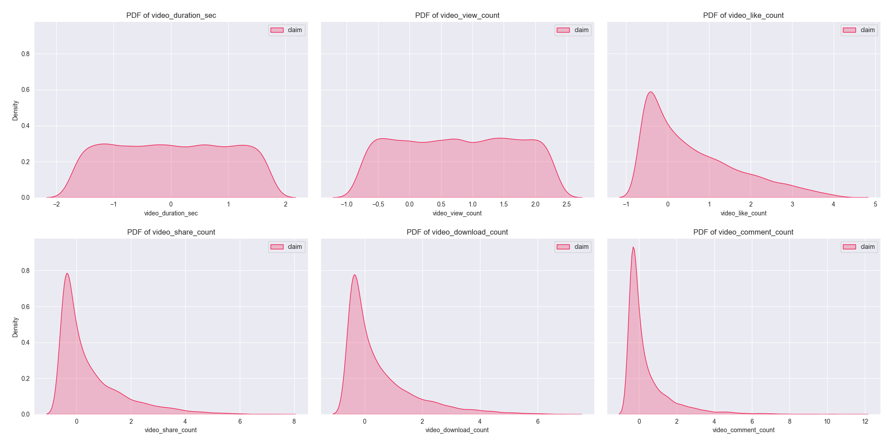

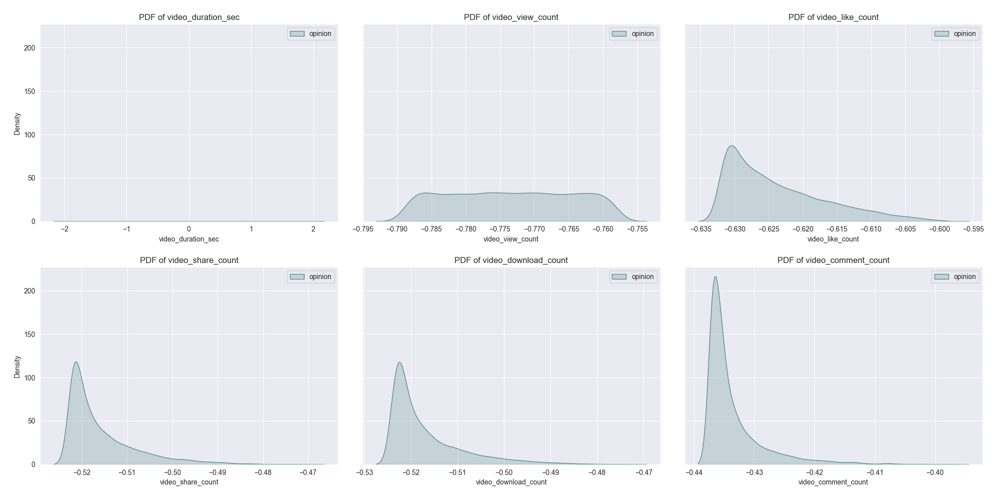

**Correlation Heatmap**

The correlation heatmap offers a quantitative perspective, highlighting that engagement metrics are not just loosely associated but are strongly interlinked. Videos identified as 'claims' are more likely to be engaging, whereas 'opinions' see slightly less interaction. Interestingly, videos from active authors are usually less associated with the 'claim' status, suggesting that creators with ongoing activity on the platform tend to share more opinions than unsubstantiated claims.

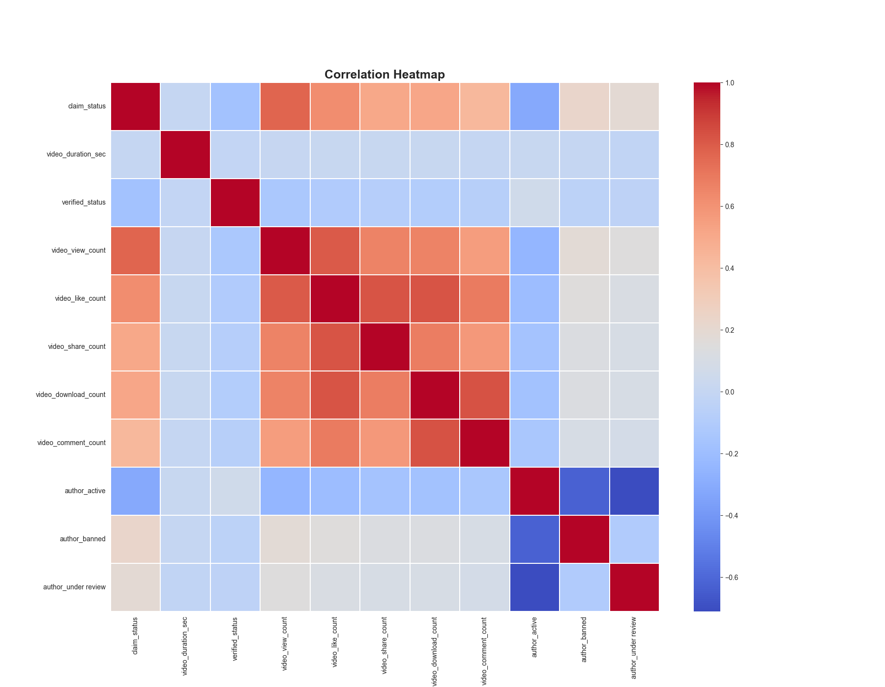

*Correlation of Numerical Features with Claim Status*

| Feature               | Correlation with 'Claim' |
|-----------------------|--------------------------|
| Video View Count      | 0.76817                  |
| Video Like Count      | 0.619399                 |
| Video Share Count     | 0.512067                 |
| Video Comment Count   | 0.430487                 |
| Author Banned         | 0.230605                 |
| Author Under Review   | 0.189853                 |
| Video Duration (sec)  | 0.003914                 |
| Verified Status       | -0.1706                  |
| Author Active         | -0.312438                |

This table conveys the strength of the relationship between various numerical features and the likelihood of a video being a claim. It highlights that engagement metrics have a strong positive correlation with claims, while active authorship is moderately inversely related. This reinforces the notion that active content creators on TikTok are less likely to produce claim videos.

#### Standardization

For optimal performance of certain machine learning models, the data set was standardized using the Standard Scaler. Post standardization, box plots were redrawn to visualize the transformed data distribution.

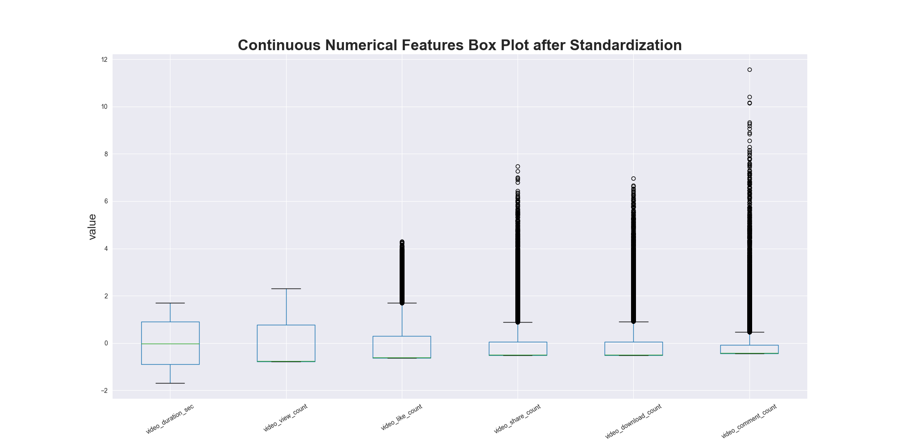

#### Training and Testing Process

The figure below encapsulates the entire training and testing pipeline, from the initial split to the final selection of the optimal model. 

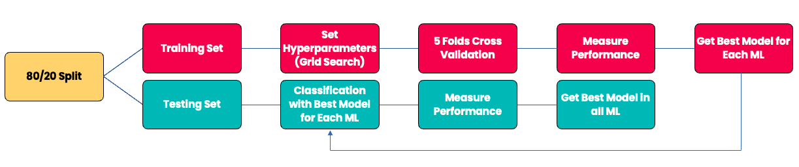

**Splitting the Data**
The dataset was partitioned in an 80/20 ratio, allocating 80\% for training our models and 20\% for testing their predictions. This split aims to provide a comprehensive learning set for the model while retaining a substantial portion for objective evaluation.

**Hyperparameter Tuning**
To enhance model performance, we undertook hyperparameter tuning using Grid Search—a technique that systematically works through multiple combinations of parameter tunes, cross-validating as it goes to determine which tune gives the best performance.

**Cross-Validation**
We employed 5-folds cross-validation to ensure that every data point gets to be in a held-out set once and gets to be in a training set 4 times. This method provides a more accurate measure of model quality, reducing the variance associated with a single trial of train-test split.

**Model Evaluation**
Model performance was assessed through various metrics, allowing us to select the best model from each machine learning algorithm and ultimately, the best overall model. This step is essential in our quest to identify a model that not only fits the training data well but also generalizes effectively to new, unseen data.

**Interpreting the Results**
The outcome of this process will yield a model that can accurately classify TikTok videos into claims or opinions, based on the features identified as significant predictors. The best-performing model will be one that achieves a balance between bias and variance, providing reliable predictions across a range of video content.

#### Training Results

In the pursuit of optimizing our machine learning models, we conducted a meticulous process of hyperparameter tuning and validation to ensure that our models not only fit the training data well but also maintain their performance on unseen data.

**Model Selection**
Upon completion of the grid search and cross-validation, we pinpointed the best hyperparameters for each model. The models were then ranked based on their cross-validation accuracy scores, leading us to determine the best-performing model for each machine learning algorithm.

*Optimal Hyperparameters and Cross-Validation Scores*

| Model                | Best Hyperparameters                                             | CV Accuracy Score |
|----------------------|------------------------------------------------------------------|-------------------|
| Random Forest        | n estimators = 200; max depth = None; min samples split = 2; min samples leaf = 2 | 0.9953            |
| Gradient Boosting    | n estimators = 200; learning rate = 0.05; min samples split = 2; min samples leaf = 8 | 0.9955            |
| KNN                  | n neighbors = 3; weights = uniform; p = Euclidean distance       | 0.9852            |
| Logistic Regression  | C = 100; solver = newton-cg                                      | 0.9915            |
| Decision Tree        | max depth = 10; min samples split = 1; min samples leaf = 2      | 0.9950            |

**Interpretation of Results**

The results table reveals that Gradient Boosting and Random Forest performed exceptionally well, with accuracy scores surpassing 99%. Logistic Regression also showed high accuracy, indicating its efficacy despite its simplicity compared to ensemble methods. These models, equipped with their best hyperparameters, are now ready to be applied to the test set for the final evaluation of their predictive power.

**Feature Importance**

Feature importance analysis, conducted after training our Random Forest model, provides valuable insights into the relative importance of each predictor variable in determining the claim status of a video. The most influential feature was the number of views, indicating that the more a video is viewed, the more likely it is to be classified correctly as a claim or opinion. Other engagement metrics such as like count, share count, and comment count also proved to be strong predictors. Conversely, features such as video duration, author status, and verified status did not play a significant role in predicting the claim status. These findings emphasize the importance of focusing on engagement-related features when predicting content classification.

**Interpretation of Results**

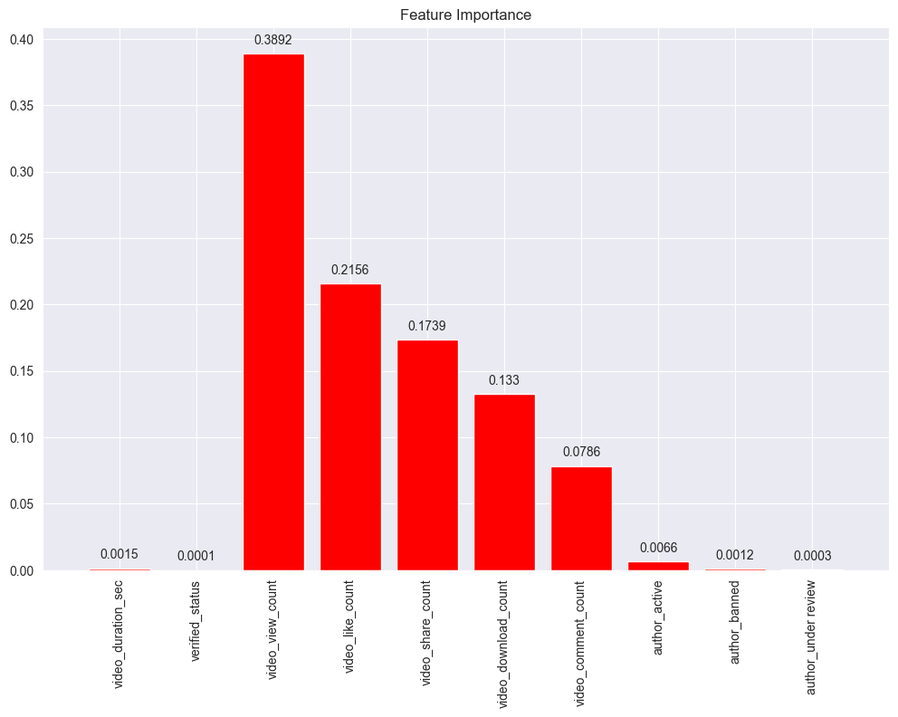

#### Testing Results

Our testing phase was pivotal in validating the predictive efficacy of the trained models. The assessment was based on a comprehensive set of metrics: Accuracy, Precision, Recall, F1 Score, and the Area Under the Curve (AUC). The table below encapsulates the performance of each model on the testing set:

*Performance Metrics of Machine Learning Models on the Testing Set*

| Model                | Accuracy | Precision | Recall  | F1 Score | AUC    |
|----------------------|----------|-----------|---------|----------|--------|
| Random Forest        | 0.9953   | 1         | 0.9907  | 0.9953   | 0.996  |
| Gradient Boosting    | 0.9955   | 0.9995    | 0.9917  | 0.9956   | 0.9963 |
| K-Nearest Neighbors  | 0.9852   | 0.9995    | 0.9772  | 0.9882   | 0.9891 |
| LDA                  | 0.8814   | 1         | 0.7754  | 0.8735   | 0.8814 |
| Logistic Regression  | 0.9915   | 1         | 0.9855  | 0.9927   | 0.9916 |
| Decision Tree        | 0.995    | 0.9958    | 0.9912  | 0.9935   | 0.9967 |

**Interpretation of Results**

The Random Forest and Gradient Boosting models demonstrated outstanding performance, with near-perfect AUC scores, which signifies their exceptional capability in classifying videos as either claims or opinions. Their high precision and recall imply a strong alignment between predicted and actual classes with minimal misclassification.

Decision Tree also showed robust performance, particularly in terms of training accuracy. However, it was marginally outperformed by Random Forest and Gradient Boosting in the testing phase, which might suggest a tendency to overfit the training data.

LDA, while perfect in precision, was markedly less accurate, indicating potential challenges in generalizing and distinguishing between classes effectively.

These results provide a clear direction for selecting a model to deploy for predicting the classification of TikTok video content, with Random Forest and Gradient Boosting being the front-runners due to their excellent balance between precision and recall, as well as their superb ability to differentiate between the claim and the opinion.

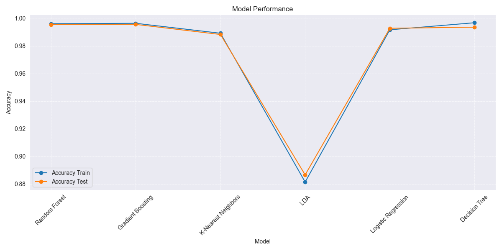

#### Conclusion of Research Question 1

Our analysis of TikTok video classification has underscored the importance of user engagement metrics as primary indicators in distinguishing claims from opinions. The high accuracy and AUC scores of our Random Forest and Gradient Boosting models demonstrate their effectiveness and readiness for real-world application.

In essence, the research reveals that while user and video characteristics like verified status or video duration have minimal impact, the way users interact with the content (views, likes, shares, comments) is crucial for classification. These findings offer practical value to platform moderators and content strategists in understanding content reach and authenticity on social media.

Well-tuned machine learning models are effective tools for parsing the vast content landscape of TikTok to discern claims from opinions, paving the way for enhanced content credibility and an informed user community.

### Research Question 2: Clustering User Engagement Metrics

#### Data Pre-processing, EDA, and Standardization

The data pre-processing phase for clustering user engagement involved selecting relevant features such as video views, likes, shares, downloads, and comments. We have performed exploratory data analysis
(EDA) to understand the distribution of these metrics and their correlation with user engagement.

After EDA, we standardized the data to normalize the scale of our numerical variables, facilitatingmore meaningful comparisons and clustering.

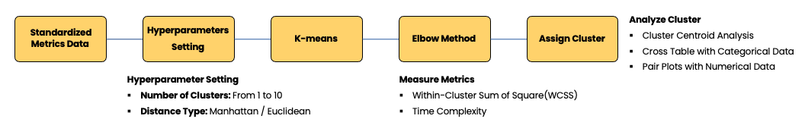

The clustering process applied K-means algorithm using an iterative approach to hyperparameter tuning. We used the Elbow Method to determine the optimal number of clusters, ensuring the most effective grouping of data points based on their similarity in engagement metrics.

#### K-means Clustering Analysis

The K-means clustering algorithm was applied post-standardization to group TikTok videos by user engagement metrics. Optimal clusters were identified using the Elbow Method, which indicated a plateau in within-cluster sum of squares (WCSS) after *3* clusters, suggesting limited gains from additional clusters. Euclidean distance was preferred over Manhattan distance for clearer cluster delineation.

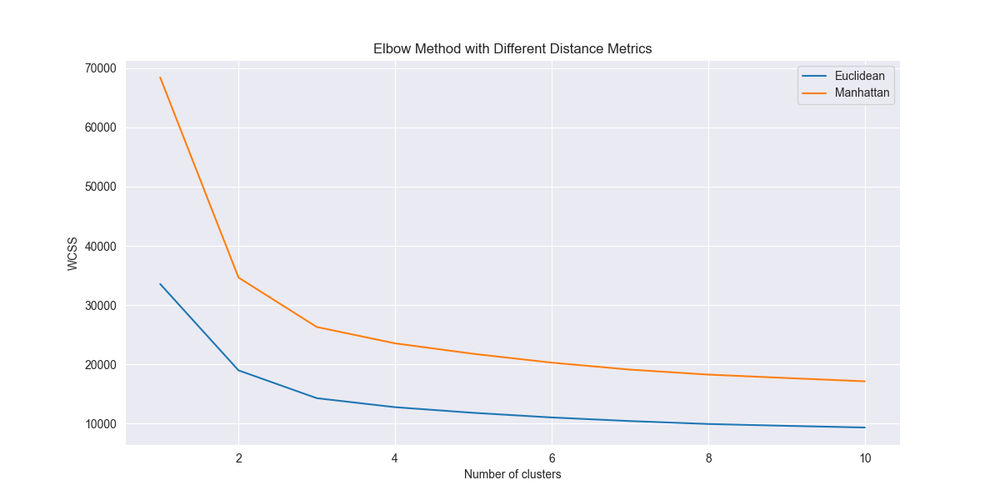

In terms of computational efficiency, the analysis of time complexity revealed that increasing the number of clusters leads to a higher computational burden. This is expected as more clusters require additional computation for assigning data points and updating centroids. The trend was consistent across both Euclidean and Manhattan distance measures, with computational time increasing steadily with the number of clusters.

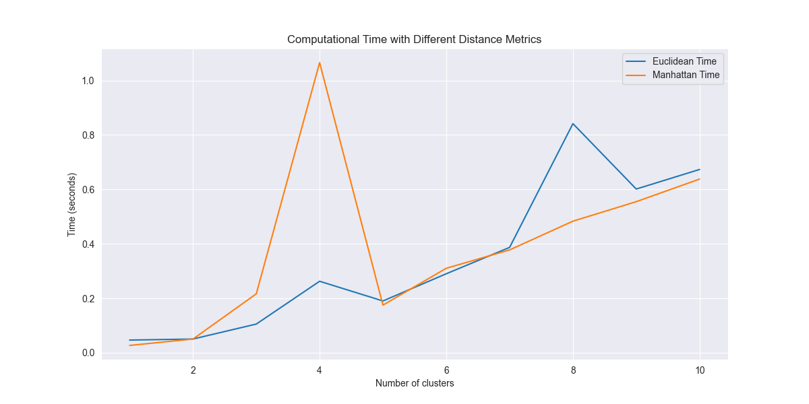

#### Result - Cluster Centroid

The K-means clustering results reveal distinct groups of TikTok videos, each with varying levels of user engagement. Cluster 0 (C0) now represents videos with below-average engagement, suggesting newer or less popular content. Cluster 1 (C1) has above-average metrics, indicating moderately popular content. Cluster 2 (C2) continues to stand out with significantly higher metrics, likely representing highly popular and engaging videos.

*Revised Centroids of K-means Clusters*

| Metric              | Cluster 0 (C0) | Cluster 1 (C1) | Cluster 2 (C2) |
|---------------------|----------------|----------------|----------------|
| Video View Count    | -0.7095        | 0.8476         | 1.4981         |
| Video Like Count    | -0.5887        | 0.2567         | 1.9474         |
| Video Share Count   | -0.4891        | 0.1279         | 1.7526         |
| Video Download Count| -0.4911        | 0.0718         | 1.8492         |
| Video Comment Count | -0.4125        | 0.0121         | 1.6291         |

#### Pair Plots Analysis

In our K-means clustering of TikTok user engagement metrics, pair plots were instrumental in revealing distinct patterns:

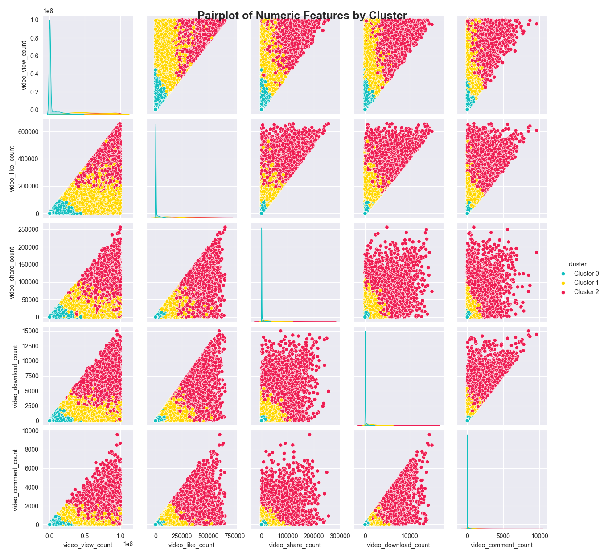

- **Cluster 0 (Turquoise):** Representing below-average engagement, this cluster has a dense concentration of points near the origin in pair plot visualizations, indicating many videos with lower engagement metrics. It is the most populous cluster, suggesting a large proportion of content falls into this engagement category.
- **Cluster 1 (Yellow):** This cluster shows a moderate level of engagement, with values above the mean. The spread of points in the pair plots indicates a variety of content performance, hinting at the potential for growth in engagement.
- **Cluster 2 (Red):** With the highest engagement metrics, videos in this cluster are less densely packed in the pair plots, which corresponds to a greater variance in high-performing videos. This cluster is indicative of viral content.

#### Conclusion of Research Question 2

The K-means clustering analysis has elucidated three distinct engagement profiles for TikTok videos. These insights are instrumental for content creators and marketers in formulating data-driven strategies. By aligning marketing efforts with the engagement profiles of each cluster, stakeholders can more effectively allocate resources, enhance user engagement, and maximize the impact of their content on the TikTok platform.

In conclusion, our clustering approach provides a framework for a nuanced understanding of user engagement, which is vital for the dynamic and competitive landscape of social media.

### Research Question 3: Topic Clustering and Share-ability

#### Data Pre-processing

The table below presents a snippet of the pre-processed data, correlating transcription texts with the number of shares, a response variable indicative of share-ability.

*Sample of Preprocessed Video Transcription Text and Share Counts*

| Video Transcription Text (Processed)                             | Video Share Count |
|------------------------------------------------------------------|-------------------|
| Drone deliveries are already happening and will become common... | 241               |
| There are more microorganisms in one teaspoon of soil than...    | 19034             |
| American industrialist Andrew Carnegie had a net worth of...     | 2858              |
| Metro of St. Petersburg, with an average depth of hundred...     | 34812             |
| The number of businesses allowing employees to bring pets to...  | 4110              |

In the study of topic shareability, our initial step was to preprocess the text data from video transcriptions. This preprocessing was multi-staged and essential for cleaning and preparing text data for further analysis, including topic modeling and word cloud visualization.

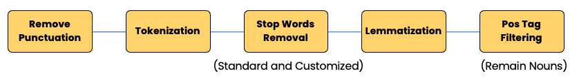

- **Punctuation Removal:** We stripped punctuation to reduce noise in the text data.
- **Tokenization:** The text was tokenized, breaking it down into individual words, or tokens.
- **Stop Words Removal:** Commonly used words contributing little to the overall meaning were removed.
- **Lemmatization:** Words were reduced to their base or dictionary form.
- **Part-Of-Speech Tag Filtering:** We retained only nouns to focus on the key subjects in the video content.

The preprocessing steps laid the groundwork for accurate and insightful topic modeling, crucial for understanding what drives the shareability of video content on social media platforms.

#### Word Cloud

**Opinion V.S. Claim**

`Opinion Shorts` predominantly feature subjective terms such as *think*, *view*, and *believe*, suggesting a personal and introspective nature. Conversely, `Claim Shorts` are characterized by terms like *report*, *discussion*, and *claim*, indicating a propensity for public discourse and factual debate. The contrast highlights opinions as reflections of individual sentiment, whereas claims are positioned for communal scrutiny and validation.

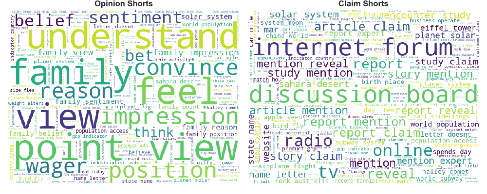

**Verified V.S. Non-verified Authors**

The word clouds distinguish the thematic content of verified versus non-verified authors' videos on TikTok. Verified authors' videos frequently showcase terms like *family*, *understand*, and *impression*, reflecting a narrative that might resonate on a personal level with viewers. In contrast, non-verified authors favor words such as *opinion*, *discussion*, and *view*, highlighting a predilection towards personal perspectives and societal discourse. This divergence suggests that verification may correlate with content that leans more towards storytelling or universally relatable subjects, while non-verified users engage in more individualistic or argumentative expression.

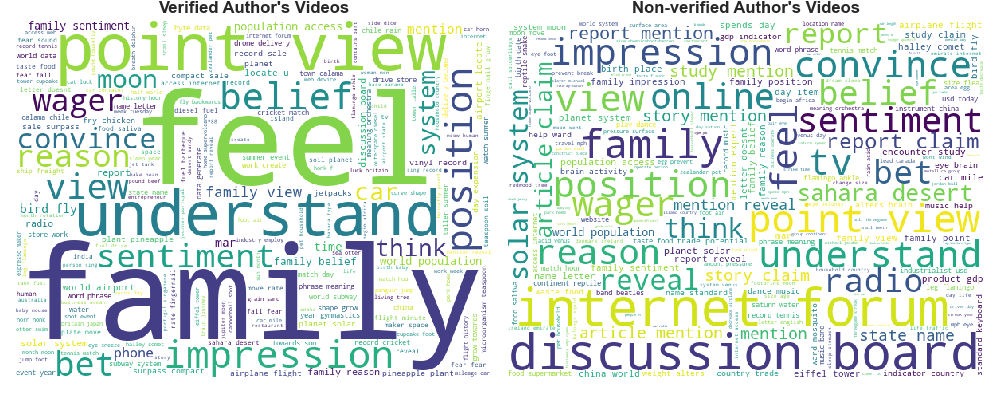

#### Sentiment Analysis

Sentiment analysis revealed a negligible inverse correlation between sentiment scores and video shares, with a correlation coefficient of -0.04493. The predominance of neutral sentiments (84.7%) in the text data, accompanied by a minority of positive (12.7%) and fewer negative sentiments (2.6%), suggests sentiment's limited impact on shareability. Consequently, sentiment was excluded from subsequent unsupervised learning models due to its insignificance in predicting video shares.

*Correlation Matrix between Sentiment and Video Shares*

| Sentiment | Video Shares |
|-----------|--------------|
| Positive  | -0.04493     |
| Neutral   | 0.01023      |
| Negative  | 0.02981      |

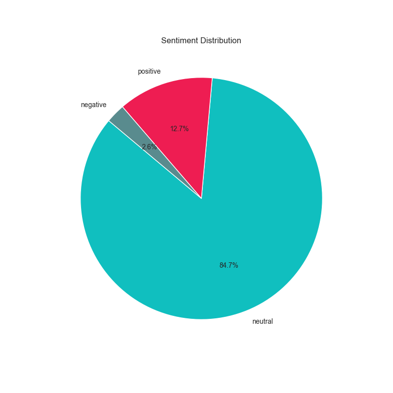

#### Topic Modeling

Topic modeling serves as a crucial analytical technique for identifying the themes within TikTok video transcripts that potentially affect shareability:

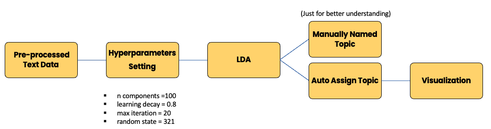

- **Latent Dirichlet Allocation (LDA):** Applied to pre-processed text data to extract topics.
- **Hyperparameter Tuning:** Selected settings included 100 topics, learning decay of 0.8, a maximum of 20 iterations, and a fixed random state for consistency.
- **Topic Assignment:** Each video was automatically assigned to a topic, with manual review for naming and contextual understanding.
- **Visualization:** Topics visualized to present the findings in an easily interpretable manner.

#### Result

The final stage of our analysis was to synthesize the topics discovered through LDA into a ranking based on their average shares. The table below showcases the top 10 topics, providing their relative shareability.

*Top 10 Topics by Average Shares*

| Rank | Topic Label             | Mean Shares | Num Videos | Std Shares |
|------|-------------------------|-------------|------------|------------|
| 1    | Internet Forum          | 30241.51    | 139        | 37919.18   |
| 2    | Strategic Games         | 27043.56    | 168        | 35880.83   |
| 3    | Research Claims         | 25488.41    | 237        | 36327.26   |
| 4    | Equestrian Olympics     | 21119.88    | 199        | 32993.61   |
| 5    | Animal Communication    | 20900.55    | 165        | 35906.48   |
| 6    | Space Heat & Population | 20336.34    | 200        | 38854.10   |
| 7    | Winter Chemistry        | 19861.58    | 222        | 34054.71   |
| 8    | Australasian Geography  | 19822.17    | 250        | 38023.23   |
| 9    | Telescope Garden        | 19536.64    | 239        | 38049.12   |
| 10   | Botanical Sports        | 19528.95    | 244        | 37662.68   |

This data reveals 'Internet Forum' and 'Strategic Games' as highly shared topics, suggesting strong user engagement. In contrast, 'Botanical Sports' and 'Telescope Garden' show lower mean shares, hinting at niche appeal. The variability in 'Std Shares' across topics indicates a mix of viral and less popular videos within each category. Content creators can use this information to focus on topics with higher share-ability.

Following the topic modeling process, we analyzed the distribution of share counts for the top and last  10 topics using histograms:

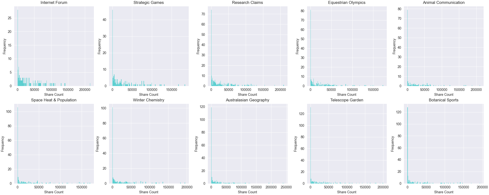

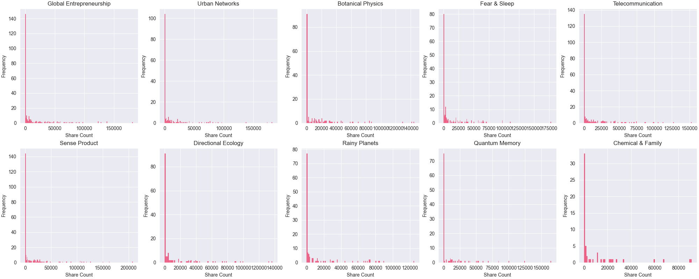

- **Variability in Sharing:** The histograms reveal significant variability within topics. While most videos have a moderate number of shares, a few outliers within topics like 'Internet Forum' and 'Strategic Games' have exceptionally high share counts.
- **Content Virality:** The spread of share counts within these popular topics suggests that while many videos do not gain widespread attention, certain videos achieve viral status, substantially elevating the mean share count.
- **Topic Popularity:** Topics such as 'Australasian Geography' and 'Telescope Garden' show a consistent share count distribution, indicating a steady level of user interest and engagement across videos.
- **Consistent Engagement:** Unlike the top topics, the last 10 topics exhibit a narrower spread of shares, suggesting a consistent but modest level of engagement across videos.

The comprehensive analysis of the top and last 10 topics provides a strategic view of the TikTok platform's content landscape. It suggests that a balanced approach, incorporating both popular and niche topics, could be beneficial for maximizing shareability and audience reach.

#### Conclusion of Research Question 3

The investigation into topic shareability on TikTok culminates with several key takeaways:
- **Content Diversity:** Our analysis indicates a diverse array of topics that resonate with TikTok users, from 'Internet Forum' discussions to 'Strategic Games', each carrying its own weight in social shareability.
- **Viral Potential:** Some topics demonstrated the potential to go viral, with certain videos reaching exceptional share counts and indicating the possibility of content to break through the noise and capture widespread attention.
- **Niche Appeal:** Other topics, while less shared overall, showed consistent engagement, suggesting a dedicated audience that values specific content, representing areas of growth and opportunity for new content creation.
- **Strategic Insights:** For content creators, these findings highlight the importance of tailoring content to both popular trends and emerging niches, striking a balance between riding the wave of viral content and cultivating a dedicated following in less saturated topic areas.

## Conclusions

The explorative journey through TikTok's data has illuminated the complex interplay between content, creator, and consumer, revealing nuanced facets of user engagement and content dissemination:
- **Claims vs. Opinions:** We have properly used Ensemble Learning Models such as Random Forest and Gradient Boosting to classify claim and opinion with 99% accuracy. The fine line dividing claims from opinions is navigated by the user's interaction with the content.
- **Clustering Engagement:** The final 3 means clustering helps in understanding the relationship between different user engagement metrics and can guide targeted strategies for each cluster. Engagement metrics cluster in a manner reflecting the varying degrees of user interaction—from passive viewership to active sharing.
- **Share-ability and Topics:** The top 10 topics may contain videos that have the potential to go viral or have already gone viral, as opposed to the last 10 topics which seem to have a more modest performance in terms of shares.

